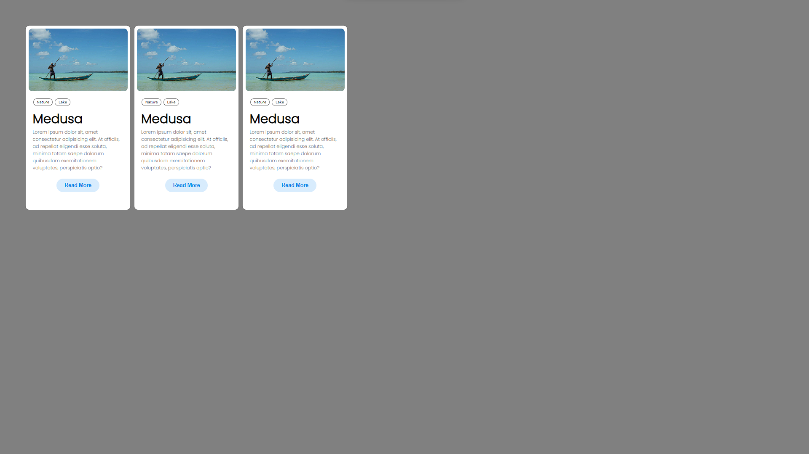

# CSS Card Design

This project is a simple demonstration of how to create a card design using HTML and CSS. The card design consists of an image, some tags, a title, a paragraph, and a button. The card design is responsive and can be used for various purposes.

## How to run the project

To run the project, you need to have a web browser and a text editor. You can use any web browser and text editor of your choice, such as Microsoft Edge and Visual Studio Code. 

- First, download or clone the project files from GitHub.
- Second, open the index.html file in your web browser. You should see three cards displayed on the screen.
- Third, you can edit the HTML and CSS files in your text editor to customize the card design according to your preferences. You can change the image, the tags, the title, the paragraph, and the button styles. You can also add more cards or remove some cards as you wish.
- Fourth, save your changes and refresh the web browser to see the updated card design.

## How the project works

The project uses HTML and CSS to create a card design. The HTML file contains the structure of the card, such as the image, the tags, the title, the paragraph, and the button. The CSS file contains the style of the card, such as the colors, the fonts, the margins, the padding, the border-radius, and the hover effects. The project also uses Google Fonts to import the Baloo Bhai 2 and Poppins fonts.

## Sample output

Here is a sample output of the project, showing three cards with images and tags:

